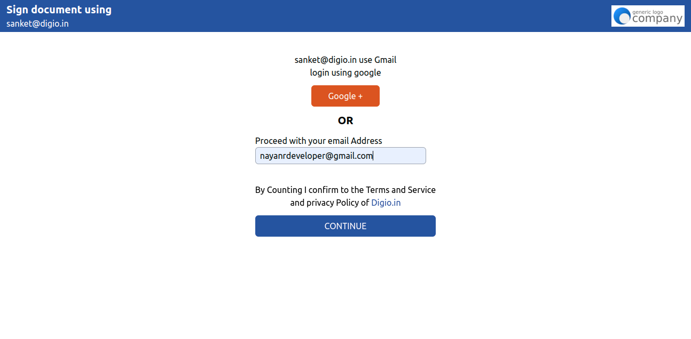
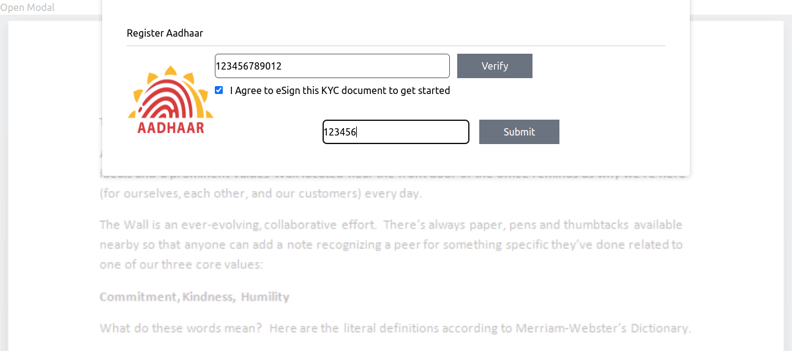

# Digio Assignment

### Technology 

- [React](https://react.dev/)
- [TailwindCss](https://nextjs.org/)
- [React Router](https://reactrouter.com/en/main)

## How to use

Clone GitHub Project on your PC

```bash
git clone https://github.com/nayanrdeveloper/digio_task_assignment
```

```bash
npm install
```

```bash
npm run dev
```

Open your Project in browser (http://localhost:5173/)

### Prerequisites

* [nodejs](https://nodejs.org/en/download/) for install require package with npm

```bash
npm create vite@latest
```

### Screenshots

Home



Verify adhar



